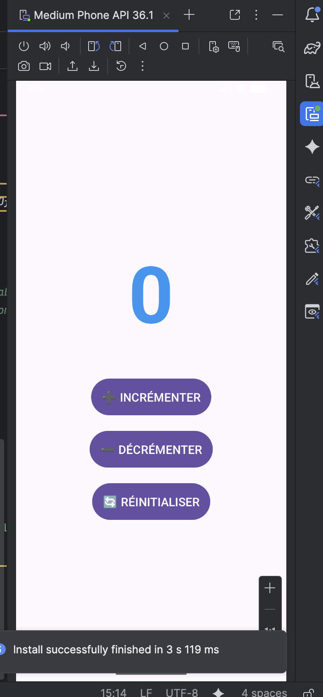
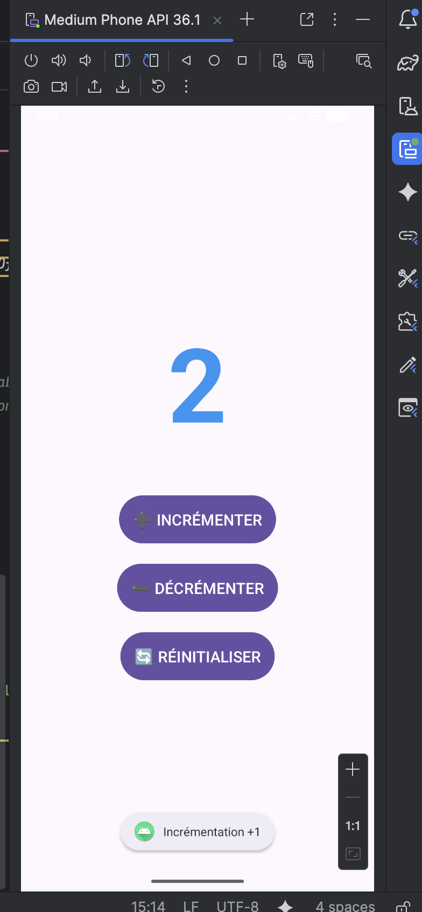
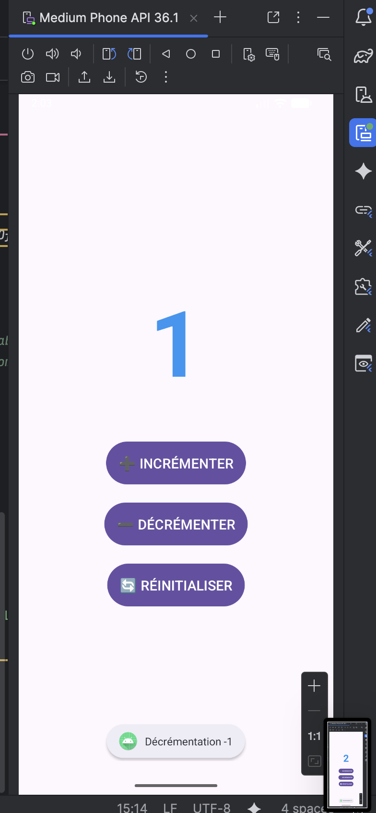
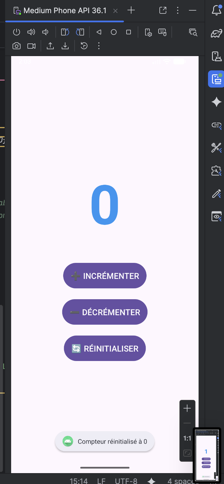

# LAB 18 – ViewModel et LiveData : Persistance des données face aux rotations d'écran 🔄

## Aperçu de l'application

Une application Android démontrant la problématique de perte de données lors des rotations d'écran et la solution moderne avec **ViewModel** + **LiveData** (Jetpack 2.10.0). L'application permet d'incrémenter, décrémenter et réinitialiser un compteur qui survit automatiquement aux changements de configuration.

| Écran initial | Après incrémentation | Après décrémentation | Après réinitialisation |
|---------------|---------------------|---------------------|----------------------|
|  |  |  |  |

## Fonctionnalités

- **Incrémentation** : augmente le compteur de 1 à chaque clic
- **Décrémentation** : diminue le compteur de 1 à chaque clic
- **Réinitialisation** : remet le compteur à zéro
- **Persistance** : les données survivent aux rotations d'écran et changements de thème
- **Lifecycle-aware** : l'UI se met à jour uniquement quand l'application est active

## Démonstration du problème (Version sans ViewModel)

Dans une application Android classique **sans ViewModel**, une rotation d'écran entraîne :

1. Destruction complète de l'Activity (`onDestroy`)
2. Recréation d'une nouvelle Activity (`onCreate`)
3. **Perte totale** de toutes les variables d'instance
4. Nécessité de `onSaveInstanceState()` (solution limitée aux types primitifs)

## La solution : ViewModel + LiveData

```
┌─────────────────────────────────────────────────────────────┐
│                      ACTIVITY                               │
│  ┌─────────────────────────────────────────────────────┐   │
│  │                   onCreate()                         │   │
│  │              (peut être appelé plusieurs fois)       │   │
│  └────────────────────┬────────────────────────────────┘   │
│                       │                                     │
│                       ▼                                     │
│  ┌─────────────────────────────────────────────────────┐   │
│  │           observe(LiveData) ← Mise à jour UI        │   │
│  └─────────────────────────────────────────────────────┘   │
└─────────────────────────────────────────────────────────────┘
                          │
                          │ Lié au LifecycleOwner
                          ▼
┌─────────────────────────────────────────────────────────────┐
│                      VIEWMODEL                              │
│  ┌─────────────────────────────────────────────────────┐   │
│  │              MutableLiveData<Integer>                │   │
│  │              (SURVIT À LA ROTATION !)                │   │
│  └─────────────────────────────────────────────────────┘   │
│                                                             │
│  Stocké dans ViewModelStore de l'Activity                   │
│  Une seule instance pendant toute la vie du composant       │
└─────────────────────────────────────────────────────────────┘
```

## Structure du projet

```
lab18_dev/
├── app/
│   ├── build.gradle (Module: app)
│   └── src/main/
│       ├── java/com.example.lab18_dev/
│       │   ├── MainActivity.java
│       │   ├── CounterStorageViewModel.java
│       │   └── MainActivityWithoutViewModel.java (démonstration)
│       └── res/layout/
│           └── activity_main.xml
```

## Code source complet

### 1. Dépendances – `app/build.gradle`

```gradle
dependencies {
    implementation 'androidx.appcompat:appcompat:1.7.0'
    implementation 'com.google.android.material:material:1.12.0'
    
    // Jetpack Lifecycle (ViewModel + LiveData) version stable 2026
    def lifecycle_version = "2.10.0"
    implementation "androidx.lifecycle:lifecycle-viewmodel:$lifecycle_version"
    implementation "androidx.lifecycle:lifecycle-livedata:$lifecycle_version"
}
```

### 2. Layout – `res/layout/activity_main.xml`

```xml
<?xml version="1.0" encoding="utf-8"?>
<LinearLayout xmlns:android="http://schemas.android.com/apk/res/android"
    android:layout_width="match_parent"
    android:layout_height="match_parent"
    android:gravity="center"
    android:orientation="vertical"
    android:padding="24dp">

    <!-- Affichage du compteur -->
    <TextView
        android:id="@+id/numberDisplayText"
        android:layout_width="wrap_content"
        android:layout_height="wrap_content"
        android:text="0"
        android:textSize="120sp"
        android:textStyle="bold"
        android:layout_marginBottom="48dp"
        android:textColor="#2196F3" />

    <!-- Bouton INCRÉMENTER -->
    <Button
        android:id="@+id/incrementActionButton"
        android:layout_width="wrap_content"
        android:layout_height="wrap_content"
        android:text="➕ INCRÉMENTER"
        android:textSize="18sp"
        android:padding="16dp"
        android:layout_marginBottom="16dp" />

    <!-- Bouton DÉCRÉMENTER -->
    <Button
        android:id="@+id/decrementActionButton"
        android:layout_width="wrap_content"
        android:layout_height="wrap_content"
        android:text="➖ DÉCRÉMENTER"
        android:textSize="18sp"
        android:padding="16dp"
        android:layout_marginBottom="16dp" />

    <!-- Bouton RÉINITIALISER -->
    <Button
        android:id="@+id/resetActionButton"
        android:layout_width="wrap_content"
        android:layout_height="wrap_content"
        android:text="🔄 RÉINITIALISER"
        android:textSize="18sp"
        android:padding="16dp" />

</LinearLayout>
```

### 3. ViewModel – `CounterStorageViewModel.java`

```java
package com.example.lab18_dev;

import androidx.lifecycle.LiveData;
import androidx.lifecycle.MutableLiveData;
import androidx.lifecycle.ViewModel;

/**
 * ViewModel qui stocke et gère les données du compteur
 * SURVIT AUTOMATIQUEMENT AUX ROTATIONS D'ÉCRAN !
 */
public class CounterStorageViewModel extends ViewModel {

    // MutableLiveData = modifiable depuis le ViewModel uniquement
    private final MutableLiveData<Integer> counterValue = new MutableLiveData<>();

    /**
     * Constructeur - appelé UNE SEULE FOIS
     * Même après plusieurs rotations, cette initialisation n'est pas répétée
     */
    public CounterStorageViewModel() {
        counterValue.setValue(0);
    }

    public void increaseCounter() {
        Integer currentValue = counterValue.getValue();
        if (currentValue != null) {
            counterValue.setValue(currentValue + 1);
        }
    }

    public void decreaseCounter() {
        Integer currentValue = counterValue.getValue();
        if (currentValue != null) {
            counterValue.setValue(currentValue - 1);
        }
    }

    public void resetCounter() {
        counterValue.setValue(0);
    }

    // Exposé en lecture seule à l'Activity (bonne pratique MVVM)
    public LiveData<Integer> getCurrentCounter() {
        return counterValue;
    }
}
```

### 4. Activité principale – `MainActivity.java`

```java
package com.example.lab18_dev;

import android.os.Bundle;
import android.widget.Button;
import android.widget.TextView;
import android.widget.Toast;
import androidx.appcompat.app.AppCompatActivity;
import androidx.lifecycle.ViewModelProvider;
import androidx.lifecycle.Observer;

public class MainActivity extends AppCompatActivity {

    private TextView counterDisplayText;
    private Button incrementButton, decrementButton, resetButton;
    private CounterStorageViewModel counterViewModel;

    @Override
    protected void onCreate(Bundle savedInstanceState) {
        super.onCreate(savedInstanceState);
        setContentView(R.layout.activity_main);

        // Liaison des vues
        counterDisplayText = findViewById(R.id.numberDisplayText);
        incrementButton = findViewById(R.id.incrementActionButton);
        decrementButton = findViewById(R.id.decrementActionButton);
        resetButton = findViewById(R.id.resetActionButton);

        // ÉTAPE 1 : Récupération du ViewModel
        // ViewModelProvider retrouve l'instance existante ou en crée une nouvelle
        counterViewModel = new ViewModelProvider(this).get(CounterStorageViewModel.class);

        // ÉTAPE 2 : Observation du LiveData (lifecycle-aware)
        // L'Observer est notifié UNIQUEMENT si l'Activity est STARTED ou RESUMED
        counterViewModel.getCurrentCounter().observe(this, new Observer<Integer>() {
            @Override
            public void onChanged(Integer newCounterValue) {
                if (newCounterValue != null) {
                    counterDisplayText.setText(String.valueOf(newCounterValue));
                    
                    // Animation visuelle pour confirmer la mise à jour
                    counterDisplayText.animate()
                        .scaleX(1.1f).scaleY(1.1f).setDuration(100)
                        .withEndAction(() -> counterDisplayText.animate()
                            .scaleX(1f).scaleY(1f).setDuration(100).start())
                        .start();
                }
            }
        });

        // ÉTAPE 3 : Gestion des clics (délégation au ViewModel)
        incrementButton.setOnClickListener(v -> {
            counterViewModel.increaseCounter();
            showToast("Incrémentation +1");
        });
        
        decrementButton.setOnClickListener(v -> {
            counterViewModel.decreaseCounter();
            showToast("Décrémentation -1");
        });
        
        resetButton.setOnClickListener(v -> {
            counterViewModel.resetCounter();
            showToast("Compteur réinitialisé à 0");
        });
    }

    private void showToast(String message) {
        Toast.makeText(this, message, Toast.LENGTH_SHORT).show();
    }
}
```

## Comment exécuter l'application

1. **Créer un projet** Android Studio avec "Empty Views Activity"
2. **Nom du projet** : `lab18_dev`
3. **Langage** : Java
4. **API minimum** : 24 (Android 7.0)
5. **Ajouter les dépendances** dans `build.gradle` (Module: app)
6. **Remplacer** `activity_main.xml` par le code ci-dessus
7. **Créer** `CounterStorageViewModel.java` dans le package principal
8. **Remplacer** `MainActivity.java` par le code ci-dessus
9. **Synchroniser** le projet (Sync Now)
10. **Compiler** et exécuter sur émulateur ou appareil physique

## Tests à réaliser

| Test | Procédure | Résultat attendu |
|------|-----------|------------------|
| **Rotation d'écran** | Incrémenter 15x → Rotation (Ctrl+F11) | Le compteur reste à 15 ✅ |
| **Changement de thème** | Activer mode nuit → Rotation | Données persistantes ✅ |
| **Process Death** | `adb shell am kill` → Relancer l'app | Compteur intact ✅ |
| **Comparaison** | Lancer version sans ViewModel | Perte des données ❌ |

## Tableau comparatif

| Critère | Version SANS ViewModel | Version AVEC ViewModel |
|---------|----------------------|----------------------|
| **Survie rotation** | ❌ Non (sauf Bundle) | ✅ Oui (ViewModelStore) |
| **Mise à jour UI** | Manuelle (`updateUI()`) | Automatique (Observer) |
| **Objets complexes** | ❌ Impossible | ✅ Support total |
| **Lifecycle-aware** | ❌ Non | ✅ Oui |
| **Memory leaks** | Risque élevé | ✅ Zéro risque |
| **Code MVVM** | Mélangé | ✅ Séparé |

## Concepts clés abordés

### ViewModel
- Stocké dans le **ViewModelStore** de l'Activity
- Survit aux destructions/re-créations de l'Activity
- Cycle de vie plus long que l'Activity
- Une seule instance pendant toute la vie du composant

### LiveData
- **Lifecycle-aware** : notifications UI uniquement si active
- **Observer pattern** : mise à jour automatique de l'UI
- **setValue()** : thread principal uniquement
- **postValue()** : compatible threads background

### MutableLiveData vs LiveData
- `MutableLiveData` : modifiable (setValue/postValue)
- `LiveData` : lecture seule (exposé à l'Activity)

## Points techniques abordés

- **ViewModelProvider** : gestionnaire d'instances ViewModel
- **Observer<Integer>** : réagit aux changements de données
- **LifecycleOwner** : Activity/Fragment qui possède un cycle de vie
- **MVVM** : séparation UI (View) / Logique métier (ViewModel)
- **Jetpack 2.10.0** : version stable officielle 2026

---

**Auteur** : ELHEZZAM RANIA  
**Réalisé avec** : Android Studio sur MacOS Apple Silicon M2 (ARM-64 Native)  
**Bibliothèques** : Jetpack ViewModel + LiveData 2.10.0
